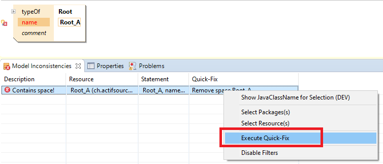

# Validation
In this project we will show how to define a model and aspect validation.

## Execute QuickFix
Removes the space in front of the ' Root_A'.

## Requirements
Actifsource  Workbench Community Edition

## License
[http://www.actifsource.com/company/license](http://www.actifsource.com/company/license)
